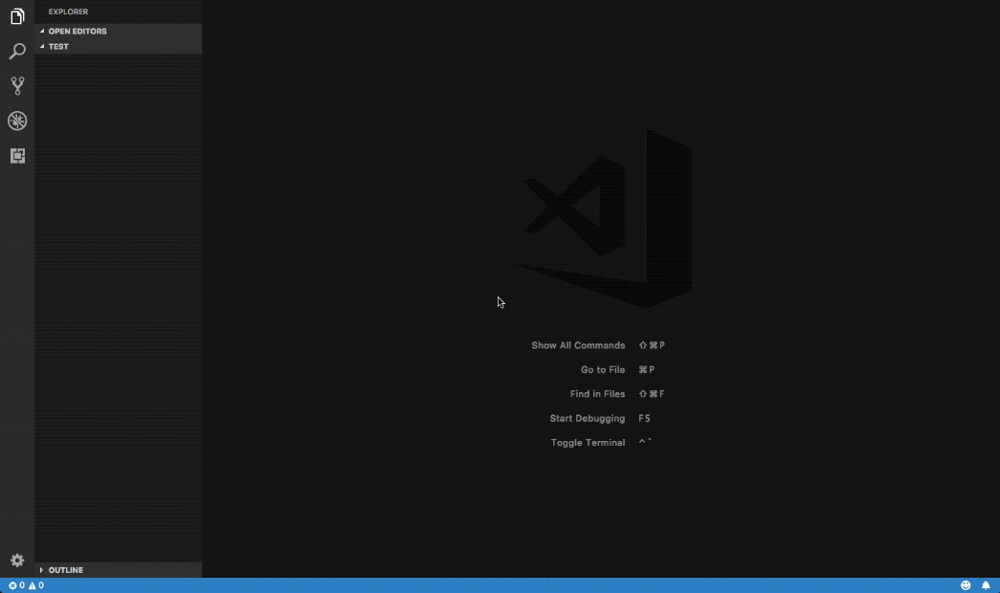

# Put a boilerplate `.gitignore` file into your current workspace home folder

## Features

Behind the curtain, [simplegitignore npm module](https://www.npmjs.com/package/simplegitignore) is used, which essentially automates the process of copying and pasting the boilerplate file from [Github's gitignore repo](https://github.com/github/gitignore) into the `.gitignore` file in your project home folder.

## How to use

Open the Command Palette (`Cmd` + `Shift` + `P`), then enter `simplegitignore`

## Known Issues

- Currently this does not attempt to gracefully handle failures. If the underlying `simplegitignore` npm module fails to output as expected, it might not translate the issue properly to you. Please check your Code editor's terminal output for details instead.
- [Known issues of the `simplegitignore` npm module itself](https://github.com/Thesephi/simplegitignore#known-caveats) are inherited in all or in parts.

## Release Notes

Please see [CHANGELOG](CHANGELOG.md)
